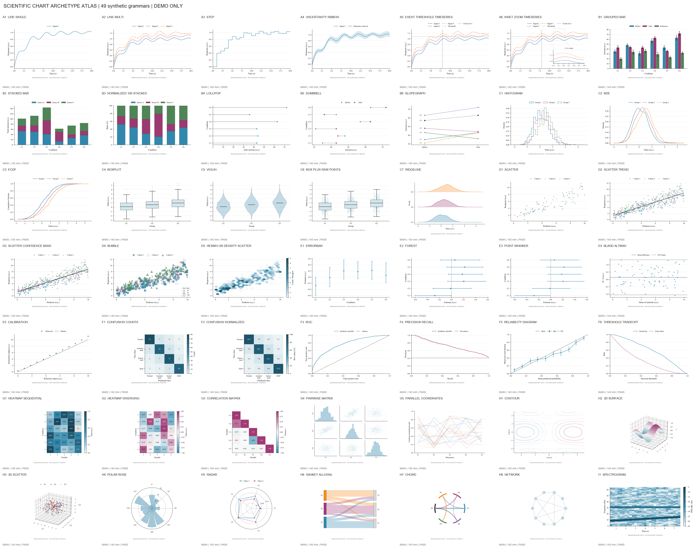
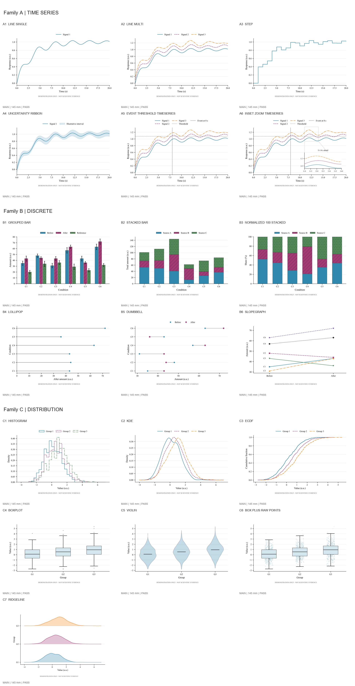
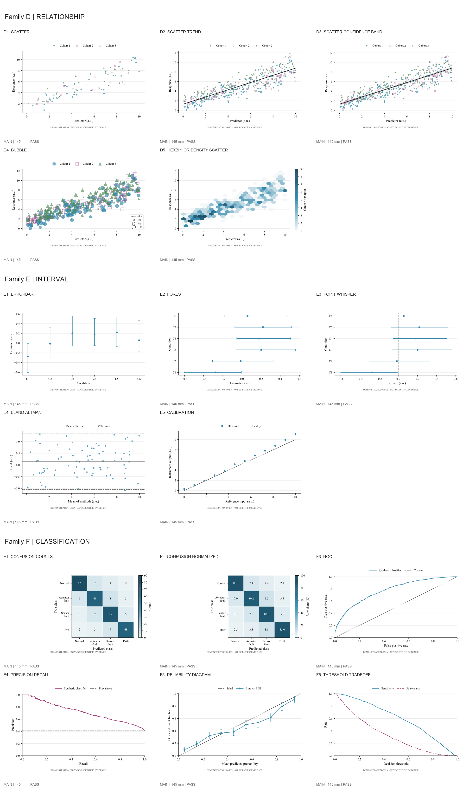
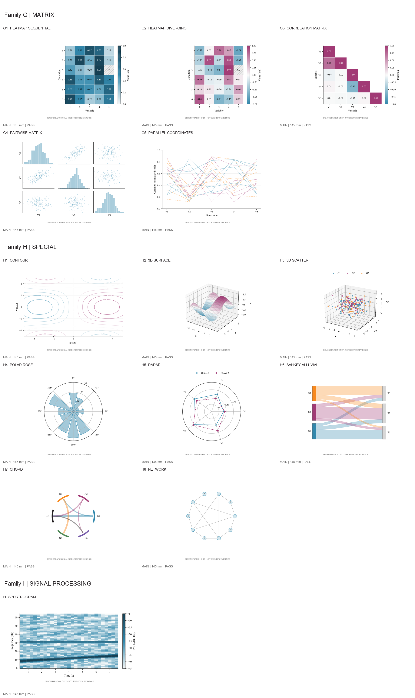
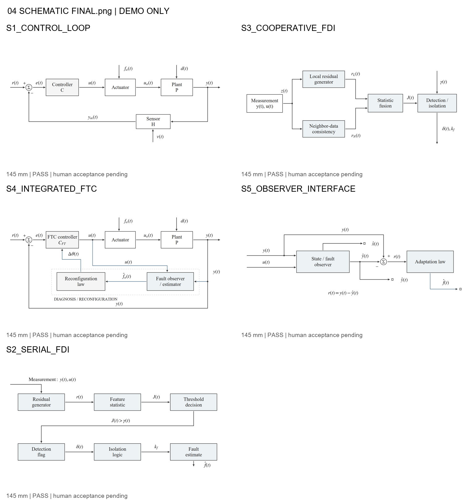
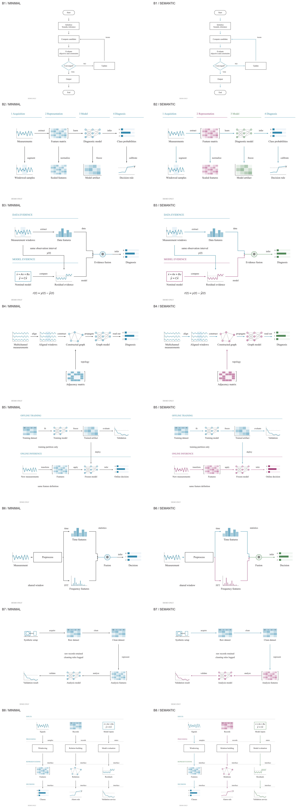
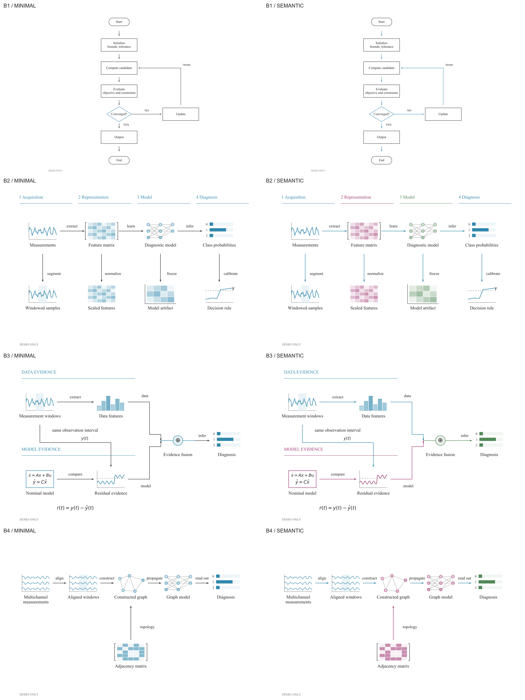
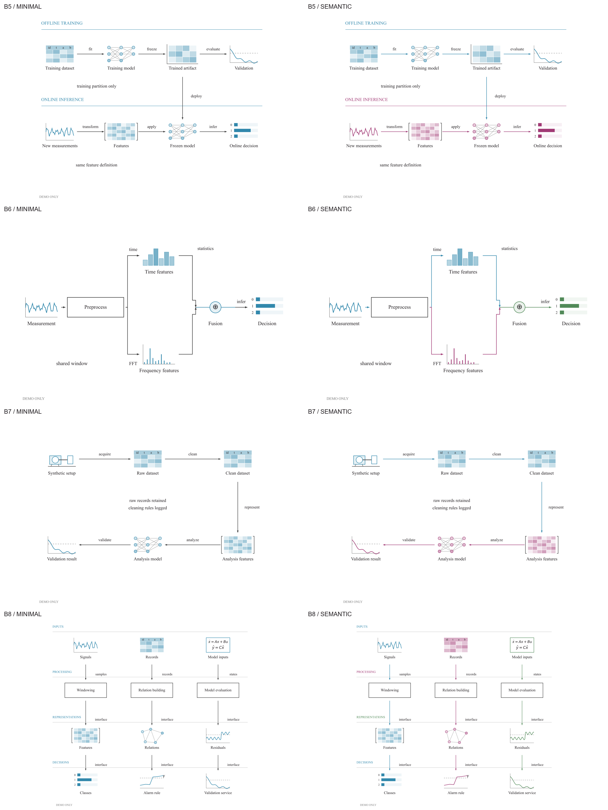

# Scientific Figure System

[English](README.md) | [中文](README_zh.md)

A small, evidence-preserving toolkit for creating publication-oriented scientific figures and editable technical schematics.

This private release candidate is for graduate students, researchers, and engineers who can use Python and Matplotlib but want stronger checks around scientific meaning, provenance, and vector output.

## What it helps with

The project has two separate products:

- **scientific-figure** creates data figures from an explicit scientific specification. Its current production-tested archetypes are `DISCRETE_COMPARISON`, `DENSE_TIMESERIES`, and `ERRORBAR_POINTWHISKER`.
- **scientific-schematic** creates semantic technical diagrams from an explicit specification. Its canonical editable output is native `.drawio` XML. It currently registers nine diagram grammars.

The central idea is simple: **data first, meaning first, style second**. The system checks that plotting and vector polishing do not silently change protected scientific values such as x/y arrays, intervals, thresholds, or event positions. When it cannot safely interpret an input, it stops and explains the problem instead of guessing.

All preview images below are generated from repository-owned synthetic benchmarks. They are visual demonstrations, not scientific evidence.

## Scientific chart atlas

<a href="docs/readme_assets/chart_archetype_atlas.png"></a>

This is a reference atlas of chart archetypes explored during development. Click the image to open the high-resolution overview. The atlas is planning material; it does not mean that all 49 explored archetypes have production renderers. The current production-tested renderers are the three types listed below.

For a more readable family-level view, the same generated atlas is split into three lossless overview sheets:

<a href="docs/readme_assets/chart_archetype_atlas_families_1.png"></a>

<a href="docs/readme_assets/chart_archetype_atlas_families_2.png"></a>

<a href="docs/readme_assets/chart_archetype_atlas_families_3.png"></a>

## Current production-supported figure types

The public candidate production scope contains three tested archetypes:

- `DISCRETE_COMPARISON`
- `DENSE_TIMESERIES`
- `ERRORBAR_POINTWHISKER`

The 49-entry chart registry is reference and planning material. It is not a claim that all 49 chart types are production renderers.

The public candidate bundles the project-owned `our_moderate_vivid` palette. Other palettes may be supplied by a user with their own provenance and suitability review; they are not silently treated as bundled defaults.

## Technical schematic examples

<a href="docs/readme_assets/schematic_quality_overview.png"></a>

These representative control, FDI, FTC, observer, and method diagrams come from our synthetic schematic quality suite. They are not copied from papers. The canonical editable source is native `.drawio` XML; the image is a display overview and does not expand the nine-grammar support boundary. draw.io Desktop application export is optional; it was locally tested with draw.io Desktop 31.4.5, while hosted CI does not run Desktop E2E.

## Flowchart grammar examples

<a href="docs/readme_assets/flowchart_grammar_overview.png"></a>

The benchmark above shows the project-owned semantic and layout grammars. For clearer detail, the same sheet is available as two lossless crops:

<a href="docs/readme_assets/flowchart_grammar_overview_1.png"></a>

<a href="docs/readme_assets/flowchart_grammar_overview_2.png"></a>

These are semantic/layout grammars, not figures copied from reference papers. The semantic specification supplies nodes, relationships, and layout coordinates; this is not AI layout of an arbitrary drawing.

## What it is not

This is not a paper-production service, a universal chart library, an automatic layout system for every diagram, or a guarantee of journal acceptance. The examples use synthetic data and are demonstrations only. Machine QA does not replace a scientist's review of the data, caption, interpretation, or final-size appearance.

## Quick start: first figure

After cloning the repository, run these commands from its root:

```powershell
git clone https://github.com/miku01031/scientific-figure-system.git
cd scientific-figure-system
python -m venv .venv
.venv\Scripts\python -m pip install -r requirements-core.txt
.venv\Scripts\python examples/synthetic/figure_minimal/run_example.py
```

The deterministic example writes an SVG under `examples/synthetic/figure_minimal/output/`. Without the optional CairoSVG layer it is named `figure.DIAGNOSTIC.svg`; with publication export available it is named `figure.svg`. It uses synthetic demonstration data, not research evidence. Core SVG generation does not require CairoSVG, PyMuPDF, or draw.io Desktop.

## Quick start: first schematic

The same core environment can generate an editable native diagram:

```powershell
.venv\Scripts\python examples/synthetic/schematic_minimal/run_example.py
```

This writes `examples/synthetic/schematic_minimal/output/diagram.drawio`. No draw.io installation is required. If draw.io Desktop is available, it can be used later for application export; that is an optional capability, not a prerequisite for native `.drawio` generation.

## Optional publication capabilities

SVG output and native `.drawio` generation are the core capabilities. PDF/PNG publication export is a separate layer:

```powershell
.venv\Scripts\python -m pip install -r requirements-publication.txt
```

This layer also needs a platform-native Cairo library. Installing the Python package `CairoSVG` alone does not guarantee that native Cairo is available. See [installation notes](docs/INSTALLATION.md) and the [runtime distribution policy](docs/RUNTIME_DISTRIBUTION_POLICY.md).

PDF inspection and PDF-QA are another optional layer:

```powershell
.venv\Scripts\python -m pip install -r requirements-pdfqa.txt
```

PyMuPDF is used only for PDF inspection; it is not a core dependency. Third-party license information is in [THIRD_PARTY_NOTICES.md](THIRD_PARTY_NOTICES.md).

## When the system stops

The tools fail closed when they cannot safely preserve meaning. Typical examples include:

- too many series for the available distinguishable encodings;
- an invalid or inverted interval;
- missing or mismatched source provenance;
- an unknown archetype or grammar;
- a missing required glyph or a forbidden raster/vector condition.

A stop is a request to fix or review the input. It is preferable to a plausible-looking figure with an unverified scientific meaning.

## Editing and review workflow

1. Prepare the scientific data and semantic specification.
2. Generate the figure or schematic.
3. Read the machine QA and capability result.
4. Inspect the artwork at its intended physical size and in context.
5. Make any required human edits and document them.
6. Use the reviewed result in the manuscript.

The schematic `.drawio` file is the editable source. Data figures are primarily published as SVG and can be refined in Illustrator, Inkscape, or another vector editor. SVG editability and grouping can vary between applications; the project does not promise identical editing behavior in every editor.

## Tested environments

Hosted core CI has passed on Windows, Ubuntu, and macOS with Python 3.10 and 3.11. The current Matplotlib range is defined by [requirements-core.txt](requirements-core.txt) as `>=3.10,<3.11`; Python version and Matplotlib version are separate constraints. Ubuntu hosted integration also tests native Cairo publication export and the optional PyMuPDF PDF-QA layer.

## Repository map

- `skills/` — the two product implementations and their local tests;
- `registries/` — reference registries and advisory records;
- `schemas/` — JSON schemas for contracts;
- `examples/synthetic/` — small deterministic demonstrations;
- `tests/` — repository, quickstart, and hygiene checks;
- `docs/` — installation, review, runtime, and dependency notes.

Start with [CONTRIBUTING.md](CONTRIBUTING.md) before changing code or adding examples. See [SECURITY.md](SECURITY.md) for the current security-reporting status.

## Author

Li Yingxi ([@miku01031](https://github.com/miku01031))

## Citation

If you use the renderer or schematic backend, please cite this software using [CITATION.cff](CITATION.cff).

## License status

The repository keeps the license decision explicit and pending author confirmation. See [LICENSE_DECISION_REQUIRED.md](LICENSE_DECISION_REQUIRED.md).
